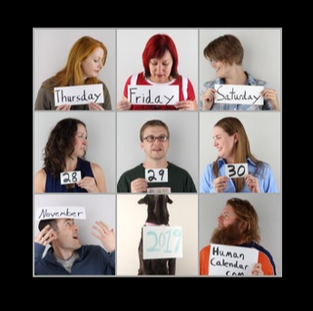

## MMM-HumanCalendar

A different kind of calendar.

## Examples

* Large, medium or small

* Config option for 1 day view and 3 day view

 

## Installation

* `git clone https://github.com/mykle1/MMM-HumanCalendar` into the `~/MagicMirror/modules` directory.

## Config.js entry and options

```
    {
          disabled: false,
        module: "MMM-HumanCalendar",
        position: "middle_center",
        config: {
          size: "small", // small, medium or large
          dayView: "1", // 1 or 3 day view
        }
      },
```

